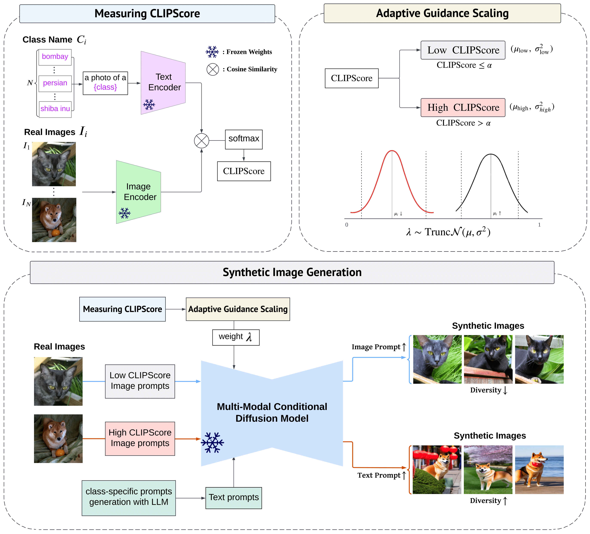

# DALDA: Data Augmentation Leveraging Diffusion Model and LLM with Adaptive Guidance Scaling

> **Authors**: Kyuheon Jung, Yongdeuk Seo, Seongwoo Cho, Jaeyoung Kim, Hyun-seok Min, Sungchul Choi

[](https://arxiv.org/abs/2409.16949)

## 🎉 Congratulations!
This repository is the official implementation of the oral paper accepted at ECCV 2024 workshop, in the SyntheticData4CV 2024: [Official Workshop Page](https://syntheticdata4cv.wordpress.com/program/#:~:text=4%3A40%20PM%2D%204,with%20Adaptive%20Guidance%20Scaling)

DALDA is an effective data augmentation framework leveraging the Large Language Model (LLM) and Diffusion Model (DM) to tackle challenges inherent in data-scarce scenarios. By embedding novel semantic information into text prompts via LLM and using real images as visual prompts, DALDA generates semantically rich images while addressing the risk of generating samples outside the target distribution.

<div align="center">
    
</div>

## Installation
```bash
# Create a virtual environment and install dependencies
conda create -n dalda python=3.10
conda activate dalda
pip install -r requirements.txt

# Download IP-Adpater models
git lfs install
git clone https://huggingface.co/h94/IP-Adapter
mv IP-Adapter/models models
```

## Datasets
<details>
<summary><strong>Commands to download datasets</strong></summary>

- Download the Flowers102 dataset
```bash
wget http://www.robots.ox.ac.uk/~vgg/data/flowers/102/102flowers.tgz
wget http://www.robots.ox.ac.uk/~vgg/data/flowers/102/imagelabels.mat
tar -xvf 102flowers.tgz
mv jpg flowers102/jpg
mv imagelabels.mat flowers102/imagelabels.mat

mkdir -p datasets
mv flowers102 datasets/flowers102
```

- Download the Oxford Pets dataset
```bash
wget https://thor.robots.ox.ac.uk/~vgg/data/pets/images.tar.gz
wget https://thor.robots.ox.ac.uk/~vgg/data/pets/annotations.tar.gz
tar -xvf images.tar.gz
tar -xvf annotations.tar.gz
mv images oxford_pet
mv annnotations oxford_pet/annotations

mkdir -p datasets
mv oxford_pet datasets/oxford_pet
```

- Download the Caltech101 dataset
    - Download the dataset from the following link: [Caltech101](https://data.caltech.edu/records/mzrjq-6wc02)
    - Arrange the dataset in the following folder structure:
    ```plain
    - datasets
        - caltech-101
            - 101_ObjectCategories
                - accordion
                    - image_0001.jpg
                    - image_0002.jpg
                - airplanes
                    - image_0001.jpg
                    - image_0002.jpg
                - ...
    ```
</details>

## How to make LLM prompt

To generate prompts using LLM(we used GPT-4), you need to set up the environment and run the appropriate script. Follow these steps to get started:

1. **Create the `.env` File**:
    In the root directory of the project, create a file named `.env` and add the following content to it:
    ```plain
    # .env file content
    
    # The feature to use OpenAI API will be updated in the future.
    AZURE_ENDPOINT=<Your_Azure_Endpoint>
    AZURE_API_KEY=<Your_Azure_API_Key>
    AZURE_API_VERSION=<Your_Azure_API_Version>
    ```

2. **Generate Prompts**:
    Once the `.env` file is set up, you can generate prompts by running the following command:
    ```bash
    python generate_prompt_by_LLM.py
    ```

## How to Train Classifier

The code to train the classifier as well as generate the composite image is in train_classifer.py. Create the file in the `configs` folder, and write the name of the created `py` file in the configuration as the execution option.

```bash
python train_classifier.py --config cfg_dalda_pets_llm_prompt_adaptive_scaling_clip
```

The `resume` feature can be used. In the config file, you can write it as follows. It means that for `seed` 0 and `examples_per_class` 8, the synthetic images have already been saved up to the 'aug-90-5.png' file.

```python
resume = [0, 8, 90, 5]
```

## Acknowledgements

This repository is developed with reference to the code from [DA-Fusion](https://github.com/brandontrabucco/da-fusion), and integrates code from [IP-Adapter](https://github.com/tencent-ailab/IP-Adapter), [diffusers](https://github.com/huggingface/diffusers), and [CLIP](https://github.com/openai/CLIP). Using this code requires compliance with their respective licenses.

## Citation

```tex
@article{jung2024dalda,
  title={DALDA: Data Augmentation Leveraging Diffusion Model and LLM with Adaptive Guidance Scaling},
  author={Jung, Kyuheon and Seo, Yongdeuk and Cho, Seongwoo and Kim, Jaeyoung and Min, Hyun-seok and Choi, Sungchul},
  journal={arXiv preprint arXiv:2409.16949},
  year={2024}
}
```